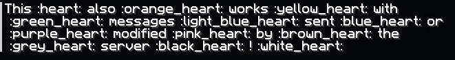
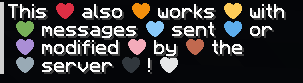

# Emoji

---

## Description 

**Emoji** is a client-side mod that lets you use emojis in chat by using their name between the characters `:`.  
For example, `:eyes:` becomes 👀.

What you see with the mod:  

What people without the mod see:  

|  |  |
|---------------------------------------------------------------|---------------------------------------------------------|

The mod itself contains no emoji, so you'll need to install resource packs to add emojis.
You can install the following resource packs to access basic emojis:  
- [Twemoji Smileys & Emotion](https://modrinth.com/resourcepack/twemoji-smileys-emotion)
- [Twemoji People & Body](https://modrinth.com/resourcepack/twemoji-people-body)
- [Twemoji Animals & Nature](https://modrinth.com/resourcepack/twemoji-animals-nature)
- Twemoji Food & Drink [WIP]
- Twemoji Travel & Places [WIP]
- Twemoji Activities [WIP]
- Twemoji Objects [WIP]
- Twemoji Symbols [WIP]
- Twemoji Flags [WIP]

**All the emojis in these packs and in the screenshots above are from [Twemoji](https://github.com/jdecked/twemoji).**

---

## Add Custom Emoji

You can add your own emojis with a resource pack.  
Every file located in `assets/[namespace]/emoji` folder and its subfolders will be considered as an emoji.  
If you want an example of a pack, you can have a look at the packs listed above.  